# ResQPlate

ResQPlate is a production-grade, location-based food rescue platform designed to bridge the gap between food donors (restaurants, events, individuals) and registered NGOs/volunteers. By leveraging real-time geospatial tracking, smart routing algorithms, and secure handoff protocols, ResQPlate ensures surplus food reaches those in need before it expires.

This is our **Final Year B.Tech Project**, built by a team of five contributors (see [Contributors](#contributors)).

---

## Key Features

* **Role-Based Architecture:** Secure, distinct workflows for Donors, NGOs, and Admins.
* **Live Real-Time Navigation (WebSockets):** "Rapido-style" live GPS tracking using native WebSockets (raw `ws`) with the token delivered via the `Sec-WebSocket-Protocol` subprotocol so it never reaches server/proxy access logs. Donors can watch the volunteer's approach in real-time with dynamic ETA, distance calculations, and live route rendering via Leaflet Routing Machine (OSRM).
* **Secure OTP Verification:** A cryptographically generated 4-digit PIN guarantees secure physical handoffs. NGOs must physically arrive and submit the Donor's PIN to complete the rescue, preventing fraud and protecting the volunteer reliability scoring system.
* **In-App Chatbot Assistant:** An integrated conversational agent to provide instant support, answer FAQs, and guide new users through the donation and claiming processes.
* **Interactive Live Map:** Powered by React-Leaflet and OpenStreetMap. Features draggable search pins, custom search radii, and one-click reverse geocoding for pinpoint accurate pickup locations.
* **Smart Request & Approve Workflow:** NGOs request food claims, and Donors retain the power to approve or reject the pickup request, ensuring safety and control.
* **O(log N) Geospatial Queries:** Utilizes MongoDB's `2dsphere` indexes to instantly find available food within a user's exact proximity.
* **Algorithmic Volunteer Routing:** Uses a Modified Firefly Algorithm (mod-FA) to calculate and notify the most reliable and proximate volunteers when a new donation is posted. Urgency widens the search radius, scales the distance-decay ("attractiveness") coefficient, and low-reliability volunteers are penalized by a mutation factor.
* **Automated Data Integrity:** A background Node-Cron job automatically scans and flags expired donations every 5 minutes to keep the live map accurate.
* **Admin Control Center:** A comprehensive dashboard to monitor platform health, verify NGO accounts, and moderate global donations.

---

## Highlights

* **Tested & CI-Ready:** 28+ automated tests across API integration, unit, notification, and WebSocket suites (Jest + Supertest + mongodb-memory-server), plus Vitest coverage on the frontend (incl. the real-time emitter).
* **Benchmarked Geospatial Search:** A reproducible benchmark (`npm run benchmark:geo`) seeds 2,000 donations and compares linear-scan vs. `2dsphere`-indexed proximity queries, reporting the exact speedup.
* **Security-Minded by Design:** JWTs travel via the WebSocket subprotocol (never query strings), tokens are never logged, OTPs are cryptographically generated, rate limiting covers all public surfaces, and secrets stay server-side.
* **Containerized Deployment:** Dockerfiles + Nginx reverse-proxy config in the repo; frontend deployable via Vercel.
* **Modular Matching Engine:** The mod-FA volunteer allocation runs behind a pure, side-effect-free util (`utils/algorithms.js`) with unit-test coverage, making it trivially swappable or benchmarkable.

---

## Data Flow Diagram

```mermaid
flowchart TD
  %% External Entities
  Donor([Donor])
  NGO([NGO / Volunteer])
  Admin([Admin])

  %% Databases (Data Stores)
  DB_User[(Users DB)]
  DB_Donation[(Donations DB)]
  DB_Claim[(Claims DB)]

  %% Processes
  Auth(1.0 Auth & Verification)
  ManageDonation(2.0 Manage Donations)
  MatchClaim(3.0 Food Matching & Claims)
  Socket(4.0 Live Tracking & WebSockets)
  Dashboard(5.0 Admin Dashboard)

  %% Auth Flows
  Donor & NGO -->|Register/Login Data| Auth
  Auth <-->|Read/Write User| DB_User
  Admin -->|Verify NGO Accounts| Auth

  %% Donation Flows
  Donor -->|Post Food Details & GPS| ManageDonation
  ManageDonation <-->|Store/Update Status| DB_Donation

  %% Claim & Matching Flows
  NGO -->|Query Location/Radius| MatchClaim
  MatchClaim <-->|Fetch Available Food| DB_Donation
  NGO -->|Request to Claim Food| MatchClaim
  MatchClaim -->|Create Pending Claim| DB_Claim
  MatchClaim -->|Notify Incoming Request| Donor
  
  %% OTP & Handoff
  Donor -->|Approve Claim & Generate OTP| MatchClaim
  MatchClaim -->|Show 4-Digit PIN| Donor
  
  %% Real-Time Tracking
  MatchClaim -->|Open Secure Room| Socket
  NGO -->|Broadcast Live GPS| Socket
  Socket -->|Push Live Map Updates & ETA| Donor
  
  %% Completion
  NGO -->|Submit Donor's OTP at Pickup| MatchClaim
  MatchClaim <-->|Verify OTP & Update Reliability Score| DB_User & DB_Claim

  %% Admin Flows
  Admin -->|Request Platform Stats| Dashboard
  Dashboard -->|Read Metrics| DB_User & DB_Donation & DB_Claim

```



## Tech Stack

### Frontend (Client)

* **Framework:** React 19 (Vite)
* **Styling:** Tailwind CSS 4
* **Mapping:** React-Leaflet, Leaflet.js
* **Routing Engine:** Leaflet Routing Machine (OSRM)
* **Real-Time Engine:** Native WebSocket client (auto-reconnect with exponential backoff, JWT subprotocol auth)
* **Geocoding:** Nominatim (OpenStreetMap API)
* **Routing:** React Router v7
* **HTTP Client:** Axios (configured with cross-origin credentials)

### Backend (Server)

* **Environment:** Node.js, Express.js, HTTP Server
* **Database:** MongoDB Atlas (Mongoose ODM)
* **Real-Time Engine:** Raw `ws` WebSocket server (heartbeat keep-alives, per-claim rooms, JWT subprotocol auth)
* **Authentication:** JSON Web Tokens (JWT), bcrypt.js
* **Task Scheduling:** node-cron
* **Validation:** express-validator
* **Security:** Helmet, express-rate-limit
* **AI Assistant:** Groq API (chat + vision), proxied server-side with a dedicated rate limiter

---

## Environment Variables

To run this project locally or in production, you will need to add the following environment variables.

### Backend (`/backend/.env`)

> **Note:** Claim accept/complete/cancel run inside MongoDB transactions, so MongoDB
> must be a **replica set** (Atlas default works; a standalone `mongod` will fail on
> those three endpoints).

| Variable                        | Description                                                                | Example                          |
| ------------------------------- | -------------------------------------------------------------------------- | -------------------------------- |
| `PORT`                        | The port your backend runs on                                              | `8080`                         |
| `MONGO_URI`                   | Your MongoDB connection string                                             | `mongodb+srv://...`            |
| `NODE_ENV`                    | Runtime environment (`development` / `production`)                     | `development`                  |
| `CLIENT_URL`                  | The URL of your frontend (CORS base)                                       | `http://localhost:5173`        |
| `FRONTEND_URL`                | Canonical frontend URL (notifications/links)                               | `http://localhost:5173`        |
| `JWT_SECRET`                  | Secret key for signing tokens                                              | `your_super_secret_key`        |
| `JWT_EXPIRE`                  | Token expiration time                                                      | `7d`                           |
| `EMAILJS_SERVICE_ID`          | EmailJS service ID (optional — emails skip when missing)                  | `service_xyz`                  |
| `EMAILJS_TEMPLATE_ID`         | EmailJS notification template ID (optional)                                | `template_xyz`                 |
| `EMAILJS_PUBLIC_KEY`          | EmailJS public key (optional)                                              | `abc123`                       |
| `NOTIFICATION_OVERRIDE_EMAIL` | Redirect all notification emails to one address (testing only)             | `dev@example.com`              |
| `GROQ_API_KEY`                | Server-side Groq key for the AI assistant (optional)                       | `gsk_...`                      |
| `GROQ_BOT_MODEL`              | Chat model used by ResQBot (defaults to`llama-3.1-8b-instant`)           | `llama-3.1-8b-instant`         |
| `GROQ_VISION_MODEL`           | Vision model used by ResQBot (defaults to`llama-3.2-11b-vision-preview`) | `llama-3.2-11b-vision-preview` |

### Frontend (`/frontend/.env`)

| Variable                                | Description                          | Example                       |
| --------------------------------------- | ------------------------------------ | ----------------------------- |
| `VITE_BACKEND_URL`                    | The URL of your backend API          | `http://localhost:8080/api` |
| `VITE_EMAILJS_PUBLIC_KEY`             | EmailJS public key (newsletter form) | `public123`                 |
| `VITE_EMAILJS_SERVICE_ID`             | EmailJS service ID (newsletter form) | `service_xyz`               |
| `VITE_EMAILJS_NEWSLETTER_TEMPLATE_ID` | EmailJS newsletter template ID       | `template_abc`              |

---

## Local Installation & Setup

**1. Clone the repository**

```bash
git clone https://github.com/manish01101/ResQPlate.git
```

**2. Go inside the repository**

```bash
cd ResQPlate/
```

**3. Setup the Backend**

> Requires MongoDB **replica set** (Atlas default works) — claim accept/complete/cancel
> run in transactions and fail on a standalone `mongod`.

```bash
cd backend
npm install
# Create your .env file here (see backend/.env.example)
npm run dev # npm run start
```

**4. Setup the Frontend**

```bash
cd ../frontend
npm install
# Create your .env file here (see frontend/.env.example)
npm run dev
```

---

## Contributors

This is our **Final Year B.Tech Project**, developed by:

* [**Manish Kumar**](https://github.com/manish01101)
* [**Salony Ranjan**](https://github.com/salonyranjan)
* [**Amit Kumar Choudhary**](https://github.com/amit11001)
* [**Sanjeev Kumar**](https://github.com/sanjeev1618)
* [**Dipu Kumar**]()

**Project Guide:**

* **Prof. Sourish Mullick** — Assistant Professor, Department of Computer Science & Business Systems (CSBS), [Netaji Subhash Engineering College (NSEC)](https://www.nsec.ac.in/), Kolkata
